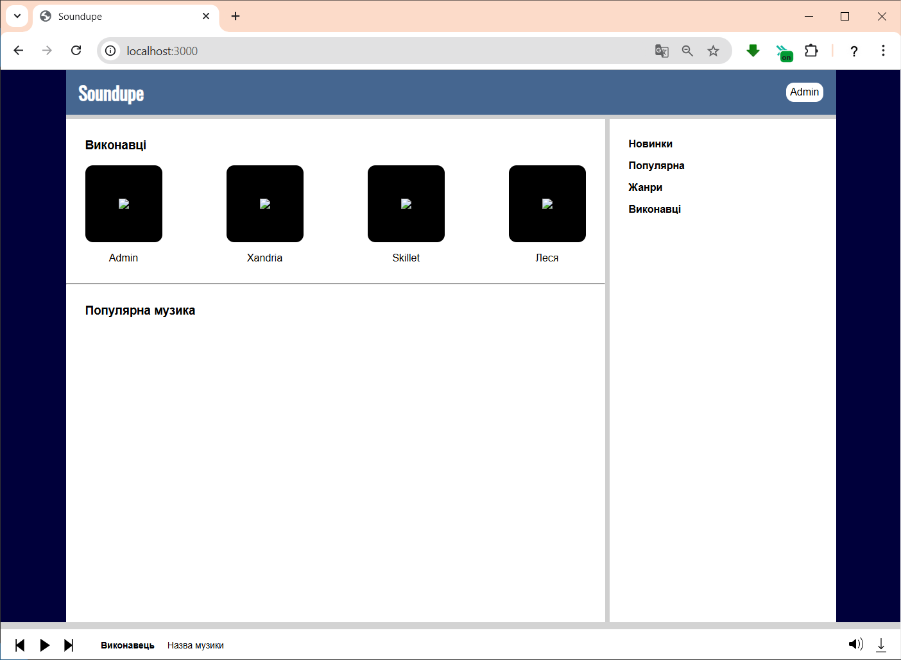

# Music Player
 Music Player is a web-based platform for listening to, downloading and sharing music. Users can create accounts and upload their own music. Built on Node.js with pure JS, HTML and CSS.

